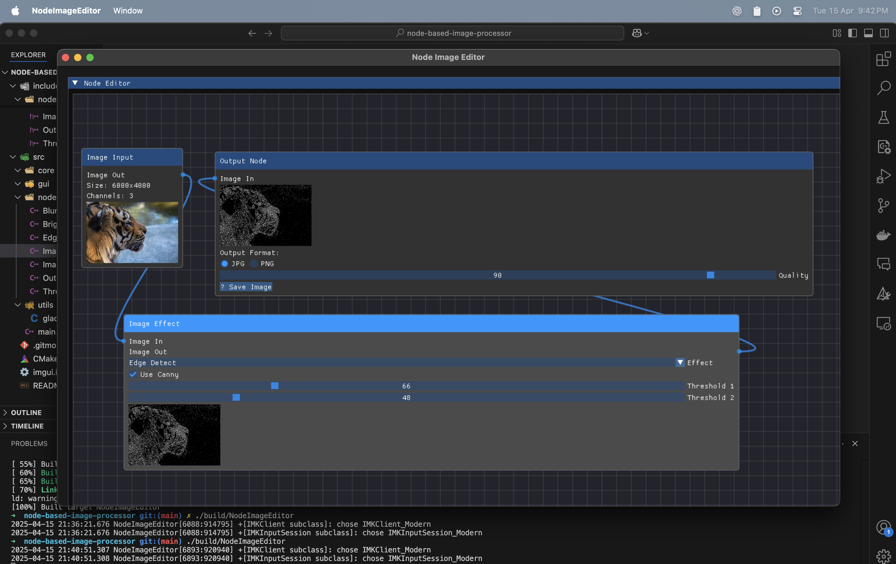

# 🧠 Node-Based Image Processing Interface

A modular, visual C++ application that allows users to manipulate images through a flexible **node editor**. Built using OpenGL and ImGui, this tool supports real-time image transformations such as blur, brightness adjustment, edge detection, noise generation, and more.

---

## 🔧 Technologies Used

| Library        | Purpose                                                            |
|----------------|--------------------------------------------------------------------|
| **OpenCV**     | Image processing operations like blur, edge detection, etc.        |
| **GLFW**       | Cross-platform window creation and input handling                  |
| **GLAD**       | OpenGL function loader                                             |
| **Dear ImGui** | Graphical user interface for node editor controls                  |
| **ImNodes**    | Extends ImGui to support a visual node graph UI                    |

---

## 🖥️ System Requirements

- **OS:** Windows, macOS, or Linux  
- **Compiler:** C++17 compatible (e.g., GCC, Clang, MSVC)  
- **Graphics:** OpenGL 3.3 compatible GPU  
- **Build System:** CMake ≥ 3.10  

---

## 📦 Installation Instructions

### 1. Install Dependencies

#### a. OpenCV

- **macOS:**  
  ```bash
  brew install opencv

	•	Ubuntu:

sudo apt-get install libopencv-dev


	•	Windows:
	•	Download from opencv.org
	•	Set the OpenCV_DIR environment variable to the OpenCV build directory

b. GLFW
	•	macOS:

brew install glfw


	•	Ubuntu:

sudo apt-get install libglfw3-dev


	•	Windows:
	•	Download or install via vcpkg

c. GLAD
	•	Visit glad.dav1d.de
	•	Configuration:
	•	Language: C/C++
	•	Specification: OpenGL
	•	API Version: 3.3
	•	Profile: Core
	•	Click Generate → Download → Extract into external/glad/

d. Dear ImGui

git clone https://github.com/ocornut/imgui.git

e. ImNodes

git clone https://github.com/Nelarius/imnodes.git


⸻

2. Build the Project

mkdir build
cd build
cmake ..
cmake --build .


⸻

🧩 Node Overview

Node	Description
Image Input Node	Load an image from disk and send it through the pipeline
Image Effect Node	Apply various visual effects (listed below)
Output Node	Render the final image with preview and export to file


⸻

🎛 Image Effects

The unified ImageEffectNode supports the following transformation effects:

Effect	Description
🔆 Brightness	Adjust brightness level from -100 to +100
🌀 Blur	Apply Gaussian blur with radius 1–20px, supports directional mode
🎨 Grayscale	Converts image to grayscale, maintains OpenGL texture format
🌓 Invert	Invert all pixel values using cv::bitwise_not()
🧊 Edge Detection	Two modes: Sobel (kernel size) and Canny (two configurable thresholds)
🧪 Custom Kernel	Define your own 3×3 kernel with presets like Sharpen, Emboss, Edge Enhance
     Live preview updates in real time	


⸻

⚙️ How to Use
	1.	Drag and drop nodes to the canvas
	2.	Link output pins to input pins
	3.	Select an effect from the dropdown in the Image Effect Node
	4.	Tune parameters via sliders, checkboxes, and inputs
	5.	Use the Output Node to preview and export the final image

⸻

🚀 Getting Started
	1.	Clone this repository
	2.	Install dependencies using instructions above
	3.	Build the project using CMake
	4.	Run the executable — edit images visually!

⸻

📸 Screenshots

### Node Editor Interface


⸻

💡 Contribution

Feel free to fork and extend:
	•	Add new node types (e.g. Morphology, Hough Lines)
	•	Add file picker, undo/redo, or export graph as JSON

⸻

🧠 Author

Made with 💻 by Mukul Gupta
Guided by the Mixar assignment specification

Let me know when you're ready to:
- Add actual screenshots (`/assets/` folder with relative paths)
- Add usage GIF or video
- Include badge shields (build, license, stars, etc.)
- Scaffold new effect nodes or testing utilities
